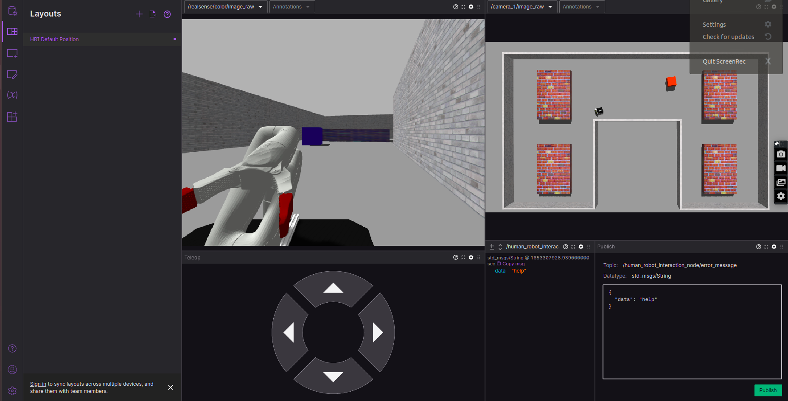
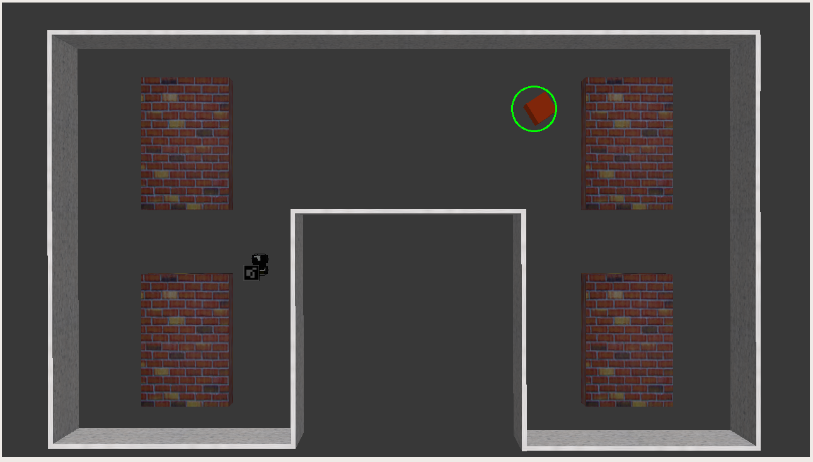

# Cor Multidisciplinary Project - Husky Simulation


Welcome to the Multidisciplinary Project - Husky Simulation repository! This repository aims to be a simple one stop shop for simulating Husky. All dependencies with their exact remote and version are listed in the `.rosinstall`. Using this it is possible to install locally.

**Important:** The only officially supported Ubuntu/ROS version is Bionic/Melodic for the Husky simulation.

## Installation
Human Robot Interaction Node --> `human_robot_interaction_node`
Create a catkin workspace and clone all required dependencies listed in `cor_mdp_husky.rosinstall`. To automate the process [vcstool](http://wiki.ros.org/vcstool) can be used:

``` bash
mkdir -p <my_catkin_ws>/src # if no catkin_ws yet
cd <my_catkin_ws>/src
git clone https://gitlab.tudelft.nl/cor/ro47007/2022/team-<XX>/cor_mdp_husky.git
vcs import --input cor_mdp_husky/cor_mdp_husky.rosinstall .
cd ..
```

Also install the dependencies that belong to the solution of team 5.
```bash
pip3 install ortools scikit-learn
rosdep install sound_play
rosmake sound_play
sudo apt-get install ros-<rosdistro>-rosbridge-suite
```

> Note: replace the `<XX>` with your team number

### Build instructions
> Note: ros_kortex require additional step to build, follow the steps on [ros_kortex](https://github.com/Kinovarobotics/ros_kortex.git)

Install any system dependencies before build
``` bash
sudo rosdep init
rosdep update
rosdep install --from-paths src --ignore-src --rosdistro=$ROS_DISTRO -y
```

Finally build and source the workspace:
``` bash
catkin build && source devel/setup.bash
```

## Quickstart

### Lely project

```
roslaunch cor_mdp_husky_gazebo husky_lely.launch
```


# Project Introduction and Definition

Robotics is weaving its way into many different industries, one of these is the agricultural industry. The inclusion of robotics in agriculture allows for slow, dull and tedious tasks to be automated, permitting the farmers to focus on more important matters such as improving overall efficiencies and production yields.

The main area of interest in this project is being able to automate the process of cleaning animal dung from barn house floors. We would like to have a robot sweep all the dung on the floor into "pockets" on the side of the path as fast as possible by planning the shortest path and cover all the area on the floor while avoiding the moving "obstacles" which would be the cow or the farmer. The robot would be using a top down camera. The robot should not run out of battery, therefore it should have returned to the charging station as it reaches 1000m.

The application is fairly straightforward as the customer is very specific about their needs. The robot will be able to perform the following tasks:
- Clean floor as quickly as possible
- Have 100% coverage of floor
- Don't hit any cows or farmers
- Keep battery charged and never run out of battery away from the charger

In order to complete this project, each of the team members have been given the task of implementing a single node, and are in charge of the implementation of a vital part of the robot's functionality. By the end of this projet all nodes should work together to solve the above problem definition and perfrom certain functions together.

This can be better explained with the functional hierarchy tree below:


**Detailed Functional Overview**

The HRI node is responsible for implementing the Finite State Machine (FSM). The FSM uses the topic: `/human_robot_interaction_node/FSM` to publish the current robot state to all other nodes. Based on the current state, all the other nodes will perform all their state dependent functions. The FSM was implemented using a ROS independent python library called "SMACH". With this library, the group decided to implement 6 operational states. The Figure below shows the FSM graph.


**1. startup_state:** In this state, the system starts up and only the Perception Node and the HRI node are initiated and running. The main goal of the startup state is to ensure the husky is error free before sweeping commences. This is done by allowing the HRI node to "tuck away" if there are no errors present, and to allow the perception node to perceive it's environment well in advance. 

**2. sweeping_state:** In this state, all nodes are active and communicating with each. The goal of this state is to use the perception node to perceive the environment, and to supply the Path Planning, Motion Dynamics and Obstacle Avoidance nodes with the necessary information to do their duties. 

**3. error_state:** In order for the system to transition into the error state, an error message must be broadcast from one of the nodes to the topic `/human_robot_interaction_node/error_message`. Every node has the responsibility to check if it's functions are able to perform desirably, and if some issues arise, the robot should transition to the error state due to safety concerns. In this state, all nodes except HRI and perception nodes are paused. The HRI node will lift the robot arm using the moveit commander action and then uses the `/robotsound` topic to convert the error message to audible sounds for the farmer to hear.

**4. low_battery_state:** In this state, a flag is raised by the Path Planning node signalling that the battery is running low. The main difference between this state and the sweeping state is that the goal destination has changed. The Path Planner plans the most direct path towards the charging station, but otherwise all other nodes still operate exactly the same.

**5. charging\_state:** In this state, the robot has reached the charging station, and is waiting for the batteries to recharge. Only the perception node and HRI node are still active in this state.

**6. finished\_state:** In this state, the entire map area has been covered, and the robot has performed it's duty. The group has decided to shut down the robot after it finishes the sweeping process, however it could also simply start sweeping the while barn floor again in an endless loop.

The nodes will be described in detail later in the readme document.

# DEMO

## Simulation demo

This is a demo run in the simulation environment. In the video you can see the FSM control node starting up, planning and then moving into the sweeping state. The Huksy eventually crashed and goes into error mode where it raises the arm after which the user takes over with manual control and drives the Husky back.


## Real world demo

This is a test that was conducted in a real world testing scenario. In the following video the HRI interface and teleoperation were tested:


# NODES

## Guidance

- [1. Human Robot Interaction](#1-human-robot-interaction-node----human_robot_interaction_node)
  
  - [1.1. Main Node Functions](#11-main-node-functions)
  
  - [1.2. Detailed Node Implementation](#12-detailed-node-implementation)
  
  - [1.3. Node Conclusion](#13-node-conclusion)

- [2. Perception](#2-perception-node)

- [3. Path Planning](#3-path-planning-node)
  
  - [3.1. Structure of the Node](#31-structure-of-the-node)
  
  - [3.2. Installing or Tools](#32-installing-or-tools)
  
  - [3.3. Expected Results](#33-expected-results)
  
  - [3.4. Launching the Nodes](#34-launching-the-nodes)

- [4. Obstacle Avoidance](#4-obstacle-avoidance-as-navigation)
  
  - [4.1. General Description](#41-general-description)

  - [4.2. File Structure](#42-file-structure)

  - [4.3. How to Use](#43-how-to-use)

  - [4.4. Demo](#44-demo)

  - [4.5. Future Work](#45-future-work)

- [5. Motion Control](#5-motion-control-node)

  - [5.1. Structure of the Node](#51-structure-of-the-node)
  
  - [5.2. Expected Results](#52-expected-results)

  - [5.3. Launching the Nodes](#53-launching-the-nodes)


## 1. Human Robot Interaction Node --> `human_robot_interaction_node`
The purpose of this node is to allow a human to safely and effectively interact with the Husky robot. The only instance in which we would like a human to interfere with the robot's duties is if there is an error with the robot that can only be solved by a human, or if the robot is having difficulties performing it's task - for example, it can't reach a narrow area which the path planner has intructed it to go. 

Another useful tool that this node provides to the human is a web observation page that can live stream what the robot is currently doing via it's camera, it displays error messages, and it can also display the route that the robot has already sweeped. This can be useful if the farmer is not constantly in the barn house, but would like to still supervise the robot.

### 1.1 Main Node Functions
In order for this node to perform it's duties, the functionalities have been split into four distinct functions.
- Move Arm
- Error Audio
- Teleoperation
- Observation


If an error is detected the robot will stop all operations and lift it's hand to signal for help. It will also play an audio sound detailing when it is about to lift the hand and inform the human where the error originated from. The error audio is useful for a human to know what the robot will be doing next.

The web observation page is useful for the farmer to keep an eye on the robot from a distance. It also provides a Teleoperation function for the farmer to manually drive the robot around in the event that the planner or robot dynamics have failed.

### 1.2 Detailed Node implementation
The Human Robot Interaction Node is included in the "husky_lely.launch" file, so it starts automatically when the simulation is run. The node structure is as follows:
- Starts by initialising the 'human_robot_interaction_node'. 
- Then it initialises the 'soundplay_node'.
- Then it initalises a rosbridge_websocket for the web observer.
- Tucks the arm away.
- Subscribes to the error message topic.
- Waits for an error.

In order to be able to use the soundplay_node, please download the following dependencies:

```
$   rosdep install sound_play
$   rosmake sound_play
```

In order to see which speakers are available and to change the default speakers, please see the following link:
source: http://wiki.ros.org/sound_play/Tutorials/ConfiguringAndUsingSpeakers

In order to use the rosbridge_websocket, please download the following dependencies:

```
$   sudo apt-get install ros-<rosdistro>-rosbridge-suite
```

#### Move Arm
Since the arm movements will be very simple, `Moveit` is used to move the arm from one pose to another. During normal operation and at startup the arm should not get in the way, therefore a new `Tucked` pose has been created. If an error occurs, a moveit_commander object has it's target pose set to `Stand`. The moveit_commander will then plan and execute the instruction, and wait until the instruction has been completed. See the two images below showing the "Tucked" and "Stand" poses respectively.

                                                                   

Error messages are published to a topic with the following structure: 
- topic: `/human_robot_interaction_node/error_message`
- datatype: `std_msgs/String` 

Messages are structured as follows:
```
{
  "data": "This is my error message to the human"
}
```

Each node can publish an error message to this topic, and since the `human_robot_interaction_node` is subscribed to this topic, it will automatically "raise the alarm" that an error has occured, stop all operations, and raise it's hand to signal for help.

If the error message contains the following message:
```
{
  "data": "Default Position"
}
```
Then the error has been resolved and the arm will move to the `Tucked` pose, signalling that the robot is ready to start it's normal operations again.

#### Error Audio
The messages published to `/human_robot_interaction_node/error_message` are also converted to audio using the text to speech conversion. These audible sounds are simply an added safety function for the human to be aware of the robot's intentions and the error without having to run detailed diagnostics.

The soundplay_node was not implemented by the group, instead it was sourced from the link provided in the "Detailed Node Implementation".

#### Teleoperation and Observation
This functionality makes use of a web app called `Foxglove Studio`, which uses all the information published to `/rosout`, and can use this information to create a user interface best suited for the farmer's needs. See image attached:

 

In order to use this application, simply navigate to:

source: https://studio.foxglove.dev/?ds=rosbridge-websocket&ds.url=ws%3A%2F%2Flocalhost%3A9090&layoutId=d10e79dc-ac63-4628-8c80-099d1e3a4160

if this doesn't work, open the following web page:

source: https://foxglove.dev/studio

Select 'Open Web App', 'Open Connection', 'Rosbridge (ROS 1 & 2)' and connect to websocket URL: 'ws://localhost:9090'.

The human can use the control interface to teleoperate the robot and also watch the robot's live movements on the web app.

### 1.3 Node Conclusion
Hopefully this documentation gave a good overview of the funtionalities of this node, and why it is useful in this project. 


## 2. Perception node
The perception node is included in the "husky_lely.launch" file so it starts automatically when the simulation is run. The node structure is as follows:
- Subribes to raw top-view camera image as input: **"/camera_1/image_raw"**. 
- Processes input using edge detection methods to segment image. Output is published to **"/image_process/output_image"**. 
- Segments image and creates occupancy map. This is also the occupancy map to be used by the path planner. Each pixel that is an obstacle gets the value **'255'** while the others are set to **'0'**. This is then published to **"/image_process/occupancy_map"**. 
- Looks for Aruco marker in image to localize the robot. The coordinates of the robots are then published to **"/image_process/husky_location"**. The visual location is then also published as an annotated image to **"/image_process/husky_tracking"**
- Localized all moving obstacles in draws circle around them. Output is then published to **"/image_process/moving_obstacles"**

**Output message types and encodings:**
- Occupancy map: **<sensor_msgs>** with encoding **"TYPE_MONO8"** 
- Husky visual location: **<sensor_msgs>** with encoding **"BGR8"** 
- Moving obstacle location: **<sensor_msgs>** with encoding **"BGR8"** 
- Huksy coordinates: **<geometry_msgs>** with type **"Point"** 


With the current image encoding RVIZ is not able to show the output images properly so the rqt viewer can be used instead as follows:

``` bash
source devel/setup.bash
rqt_image_view
```

In the top menu select the correct publish topic according to the ones mentioned above. 

An example of the image outputs can be seen below:

**Input Image**:


**Segmented Image**


**Husky location**


**Moving obstacles**



## 3. Path planning node
This nodes takes care of calculating a feasible path for husky to cover the entire map in the quickest way possible.
As input it take the occupancy map and position published by the perception node.
As output it publishes an array of 2D coordinates to follow by Husky to fully cover the map.

### 3.1 Structure of the node
The node is made up out of a single class, ```PathPlanning```. The inputs of the class are onlt the occupancy map, pixel size of the robot and the localization of Husky. These input together are used to generate waypoints over the entire map. These waypoints are solved using a custom first solution heuristic. Also another solver is there, called ```google_tsp()```, but our handmade solution create a much more optimal path. 

Once the object is initialized the following function will iniate the whole path planning node:
```python
path_planning = PathPlanning(
        ros_enabled = ros_enabled,
        husky_size = husky_size,
        start_position_husky = start_position_husky,
        geometric_distance = geometric_distance,
        waypoint_scale = 2, 
        solver = solver
    )

path_planning.listener()
```

### 3.2 Installing OR-tools
In order to run this node, a dependency needs to be installed, the optimization library from Google and scikit-learn.
```bash
pip3 install ortools scikit-learn
```

### 3.3 Expected results
The result in the whole application should be the publish of messages which contain the entire path array on the rostopic ```/global_waypoints```. This should look something like this:
```bash
layout: 
  dim: []
  data_offset: 0.0
data: 
  - [1.4 9.8]
  - [ 2.1 15.4]
  - [ 2.8 15.4]
  - [ 3.5 15.4]
  - [ 4.2 15.4]
  - [ 4.9 15.4]
...

```

The output of the line graph should look something like this:


### 3.4 Launching the nodes
The node itself can simply be launched by launching the launch file
```bash
roslaunch path_planning path_planning.launch
```


## 4. Obstacle Avoidance as Navigation

> This node is contributed and maintained by _Liangchen Sui (l.sui@student.tudelft.nl)_.

---
### 4.1 General Description

- #### Overview

    This repository constructs a subsidiary package for the Lely project based on ROS as **_Navigation Module_**. The main challenge here is to provide an accurate and safe algorithmatic solution for obstacle avoidance **under highly dymamic and random environment**.

- #### Methodology and Improvements
    
    The algorithm is based on [Artificial Potential Field](http://www.diag.uniroma1.it/~oriolo/amr/slides/MotionPlanning3_Slides.pdf "Click to see the reference") (APF)${}^{[1]}$ in workspace $W$. The implemented method aims to overcome its incomplete nature caused by local minimum with a workaround of **_online, discritized best-first algorithm_** under dynamic environment.
    
- #### Information Flow

    ```mermaid
    flowchart LR
        perception==>|occupancy_map|obstacle_avoidance
        perception==>|robot_position|obstacle_avoidance
        global_planning==>|global_waypoints|obstacle_avoidance
        obstacle_avoidance==>|refined_waypoints|motion_control
        HRI==>|FSM|obstacle_avoidance
        obstacle_avoidance==>|error|HRI
    ```

    Given `occupancy_map`, `robot_position`, `global_waypoints` and `FSM_state`, this node generates an APF considering both static and dynamic obstacles and output `refined_waypoint` and `error` message in a real-time manner.

---
### 4.2 File Structure

The file tree under this package `obstacle_avoidance` is structured as:

```
.
├── apf_avoider
│   ├── apf_avoider.py
│   ├── apf_multi_avoider.py
│   ├── apf_real_avoider.py
│   └── apf_velocity_avoider.py
|
├── fake_map
│   ├── fake_map.py
│   ├── lely_map.PNG
│   └── lely_map.yaml
|
├── fake_waypoints
│   └── fake_waypoints.py
|
├── launch
│   ├── demo.launch
│   └── obstacle_avoidance.launch
|
├── CMakeLists.txt
├── package.xml
└── README.md
```

- As a collection of distinctively implemented variations of APF, the folder `apf_avoider` contains 4 following Python scripts:

  - the `apf_avoider.py` for a naive implementation
  - the `apf_multi_avoider.py` for better optimality with multiple repulsive field generated
  - the `apf_velocity_avoider.py` for velocity-based motion control
  - the `apf_real_avoider.py` for cooperative work after calibration

- For demo simulation and performence test, the folder `fake_map` and `fake_waypoints` constructs a self-made simulatior with more  randomly moving obstacles under user's customization.


---
### 4.3 How to Use

- To begin with, please firstly go back to the parent directory in your workspace and build the catkin workspace for ROS with command `catkin build` or `catkin_make`.

- For a sole demo with built-in mini simulator, please run this command in the terminal:
    ```
    roslaunch obstacle_avoidance demo
    ```

- For an integrated project within Gazebo, please run this command in the terminal:
    ```
    roslaunch cor_husky_gazebo husky_lely
    ```

---
### 4.4 Demo

As shown below, the demo is operated in a mini simulator with multiple obstacles moving randomly. The monitor contains 5 scopes for detailed visualizations:

- Attractive Field
- Repulsive Field
- Artifitial Potential Field (Sum)
- Local Scope
- Global Scope


_*The red rectangle circumscribes the local perceptive field, where the APF is actually generated._

_*The blue dot is located at the center of robot._

_*The cyan dot is the look-ahead refined waypoint to follow for real-time obstacle avoidance._

_*The green dot is the final goal to reach._


---
### 4.5 Future Work

- To tune hyperparamters {`movingStep`, `attractiveScaler`, `repulsiveScaler`} for a more suitable step and a better safety margin.

- To mitigate the inevitable loss of acuraccy when robot approaching the wall and being repelled away.

- To erase accumulated errors through light-weighted implementation with better real-time performance.


## 5. Motion control node
This node makes the husky robot move along the waypoints it receives by the navigation and planning node.

### 5.1 Structure of the node
The node is made up out of a single class, ```Motion_control```. This class receives an array of waypoints from the navigation node which it uses as goals.
It takes the position of the robot and the position of the goal, and calculates the distance and the angle between the robot and the goal.
The node also knows the orientation of the robot and with that it calculates the angle between the orientation of the robot and the straight line to the goal.
According to this angle, the robot starts to move with a greater angular velocity or with a greater lateral velocity. 
If the angle is very large, the robot will stay in place and rotate on the spot, whereas if the angle is very small, the robot will only drive forward.


### 5.2 Expected results
The result in the whole application should be the publish of cmd_vel messages, which the Husky robot uses to move along a line between its position and the goal.
An example of output is visible below:


This image shows the location, the distance and the angle to the goal in the terminal.
It is visible that the angle to goal is very small, which means the robot is just going to drive in a straight line.


### 5.3 Launching the nodes
The node itself can simply be launched by launching the launch file
```bash
roslaunch motion_control motion_control.launch
```
